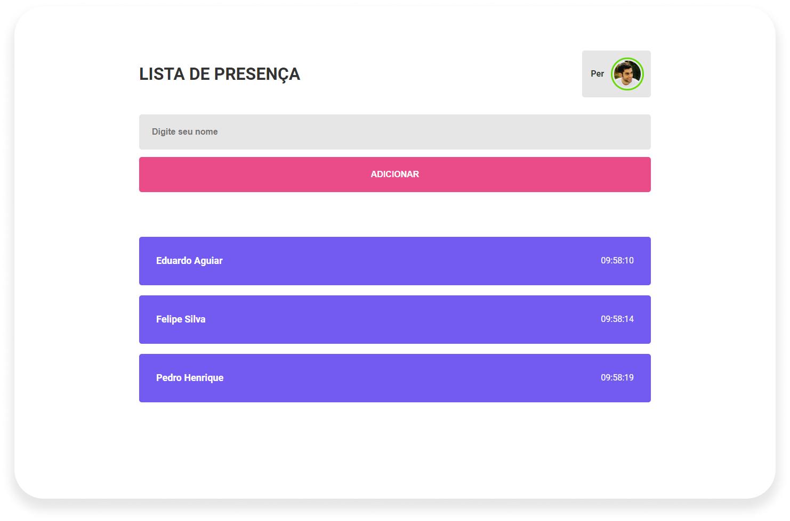

### Project Developed on Discover, ReactJS Fundamentals Trail at [Rocketseat](https://www.rocketseat.com.br/).

This project was developed on the [ReactJS](https://reactjs.org/) framework and using [Vite](https://vitejs.dev/) to
create the project.

### How to use the project:

    Clone this repository on your computer.
    Open the terminal and navigate to the project folder.
    Run the command: `yarn` to install dependencies.
    Run the command: `yarn dev` to start the development server.

